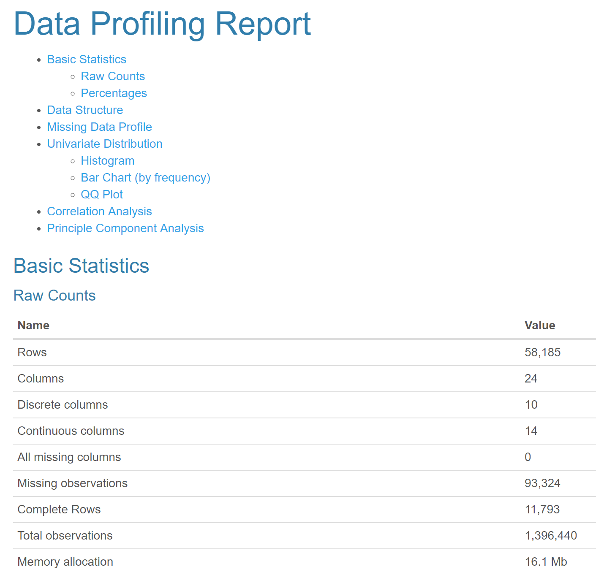

```{r setup, include=FALSE}
knitr::opts_chunk$set(echo = TRUE, warning = FALSE, messages = FALSE, fig.height = 4, fig.width = 10.5)
```
background-image: url("wind_farmM.jpg")
background-size: cover
# Week 32 of #TidyTuesday
---
# Overview
This weeks #TidyTuesday data set contains location and characteristic information about wind turbines in the USA. Some potential questions:

+ How do newer installations compare to older turbines?
+ Which states/regions have the most wind farms?
+ Where is the most missing data?
+ Spread of wind turbines over time?

## Load data
I am trying to get better at using the here:: package to make the code even more reporoducible.
```{r, message=FALSE}
library(tidyverse)
library(here)
library(ggthemr)
library(knitr)
library(scales)
library(leaflet)
library(DataExplorer)
```

---
# kable(head(us_wind), format = 'html')
```{r load data, warning=FALSE, message=FALSE, echo =FALSE}
# Load data
us_wind <-
  read_csv(here("US_wind.csv"), na = c("missing",-9999, "n/a")) %>% rename(longitude = xlong, latitude = ylat)
  kable(head(us_wind), format = 'html')
  # Set theme
  ggthemr(palette = "fresh", set_theme = TRUE)
```
---
# Analysis/visualization
## Where is the most missing data?
```{r data explorer, fig.height=4, dev='svg'}
# Use DataExplorer
plot_intro(us_wind)
```
---
## Use DataExplorer::create_report(us_wind) to create an HMTL summary report of the data.
--

---
# Missing data?
```{r, fig.height=4, dev='svg'}
plot_missing(us_wind)
```
---

# Remove duplicates
There are a number of duplicate records for some wind farms that need to be removed. 
```{r}
wind_dedup <- us_wind %>% distinct(t_fips, p_name, .keep_all = TRUE)
kable(introduce(wind_dedup), format = 'html')
```

This results in a total of 1,666 wind farms.
---
# Which states have the most farms?
```{r bar chart, fig.height=7, dev='svg', echo=FALSE}
state_20  <-
  wind_dedup %>% group_by(t_state) %>% summarise(t_state_n = n()) %>% top_n(t_state_n, n = 20)
  ggplot(state_20, aes(reorder(t_state, t_state_n), y = t_state_n)) + geom_bar(stat = "identity") + coord_flip() + scale_y_continuous(labels = comma_format()) + labs(
  x = " ",
  y = "Number of wind farms",
  title = "Top 20 states with wind farms",
  caption = "Source: usgs.gov"
  )
```
---
# Where are the wind farms located?
```{r interactive map, warning=FALSE, message=FALSE, out.width='100%', fig.height=6, eval=require('leaflet')}
#Filter out Guam
us_wind2 <- wind_dedup %>% filter(t_state != "GU")
leaflet(us_wind2) %>% addTiles() %>%
  addCircleMarkers(radius = 4, color = "blue", stroke = FALSE, fillOpacity = 0.5,
    popup = ~t_county)
```
---
# Cluster map
```{r cluster map, warning=FALSE, message=FALSE, out.width='100%', fig.height=6, eval=require('leaflet')}
leaflet(data = us_wind2) %>% 
  setView(-97.3606922, 37.7084083, zoom = 4) %>% 
  addTiles() %>% addMarkers(clusterOptions = markerClusterOptions())
```
---
# Heat map - turbines per farm
```{r heat map, warning=FALSE, message=FALSE, out.width='100%', fig.height=5, eval=require('leaflet')}
library(leaflet.extras) #<<
leaflet(data = us_wind2) %>% 
  setView(-97.3606922, 37.7084083, zoom = 4) %>% 
  addTiles() %>% addHeatmap(
    lng = ~longitude, lat = ~latitude, intensity = ~p_tnum,
    blur = 20, max = 0.05, radius = 15)
```
---
# How have they changed over time?
+ Has turbine capacity changed?
+ Has the number of turbines changed?
+ Has the height of the wind farm turbines changed?
```{r , warning=FALSE, message=FALSE}
capacity <-
  wind_dedup %>% group_by(p_year) %>% summarize(avg_capacity = mean(t_cap, na.rm = T))
turbines <-
  wind_dedup %>% group_by(p_year) %>% summarize(avg_turbines = mean(p_tnum, na.rm = T),
  range_turbines = IQR(p_tnum, na.rm = T))
height <-
  wind_dedup %>% group_by(p_year) %>% summarize(avg_height = mean(t_ttlh, na.rm = T))
```
---
# Turbine capacity
```{r , warning=FALSE, message=FALSE, fig.height=4, dev='svg'}
ggplot(capacity, aes(x=p_year, y=avg_capacity)) + 
  geom_point(size=4) + 
  geom_segment(aes(x=p_year, 
                   xend=p_year, 
                   y=0, 
                   yend=avg_capacity)) + labs(x = " ",
  y = " ", title="US wind farms - average turbine capacity (kW), 1981 to 2018", 
       caption="Source: usgs.gov")
```
---
# Turbine number
```{r , warning=FALSE, message=FALSE, fig.height=4, dev='svg'}
ggplot(turbines, aes(p_year, avg_turbines)) + geom_line() +
  scale_y_continuous(labels = comma_format()) + labs(
  x = " ",
  y = " ",
  title = "US wind farms - average number of turbines, 1981 to 2018",
  caption = "Source: usgs.gov"
  )
```
---
# Turbine height
```{r , warning=FALSE, message=FALSE, fig.height=4, dev='svg'}
ggplot(height, aes(p_year, avg_height)) + geom_bar(stat="identity") +
  scale_y_continuous(labels = comma_format()) + labs(
  x = " ",
  y = " ",
  title = "US wind farms - average height of turbines (metres), 1981 to 2018",
  caption = "Source: usgs.gov"
  )
```
---
# Turbine height vs capacity
```{r scatter, warning=FALSE, message=FALSE, fig.height=4, dev='svg'}
ggplot(wind_dedup, aes(t_ttlh, t_cap)) + geom_point() +
  scale_y_continuous(labels = comma_format()) + labs(
  x = "Height (m)",
  y = "Capacity (kW)",
  title = "US wind farms - turbine height vs capacity, 1981 to 2018",
  caption = "Source: usgs.gov"
  )
```
---
# Wind farms over time
```{r line chart, warning=FALSE, message=FALSE, fig.height=4, dev='svg'}
wind_date <- wind_dedup %>% group_by(p_year) %>% summarise(n()) %>% 
  rename(count = `n()`)
ggplot(wind_date, aes(p_year, count)) + geom_line() +
  scale_y_continuous(labels = comma_format()) + labs(
  x = " ",
  y = " ", title = "US wind farms, 1981 to 2018",
  caption = "Source: usgs.gov")
```
---
# Results

+ 6.7% of the data were missing and the t_img_date variable had the most missing data
+ Texas, Iowa and California have the most wind farms
+ The average number of turbines per project has declined over time
+ The average turbine capacity (kW) has increased over time but there is lots of missing data
+ The average height of the turbines has increased over time
+ The number of wind farms has increased since around 2000, and reached a peak in 2012
---
# Package citations

  Boxuan Cui (2018). DataExplorer: Data Explorer. R package version 0.7.0.
  https://CRAN.R-project.org/package=DataExplorer
  
  Ciaran Tobin (NA). ggthemr: Themes for ggplot2. R package version 1.1.0.

  Hadley Wickham (2017). tidyverse: Easily Install and Load the
  'Tidyverse'. R package version 1.2.1.
  https://CRAN.R-project.org/package=tidyverse
  
  Hadley Wickham (2018). stringr: Simple, Consistent Wrappers for Common
  String Operations. R package version 1.3.0.
  https://CRAN.R-project.org/package=stringr
  
  Yihui Xie (2018). knitr: A General-Purpose Package for Dynamic Report
  Generation in R. R package version 1.20.
  
  Joe Cheng, Bhaskar Karambelkar and Yihui Xie (2018). leaflet: Create
  Interactive Web Maps with the JavaScript 'Leaflet' Library. R package version
  2.0.1. https://CRAN.R-project.org/package=leaflet
  
  Bhaskar Karambelkar and Barret Schloerke (2018). leaflet.extras: Extra
  Functionality for 'leaflet' Package. R package version 1.0.0.
  https://CRAN.R-project.org/package=leaflet.extras
---
class: center, middle

Slides created via the R package [**xaringan**](https://github.com/yihui/xaringan).

The chakra comes from [remark.js](https://remarkjs.com), [**knitr**](http://yihui.name/knitr), and [R Markdown](https://rmarkdown.rstudio.com). The theme is [**metropolis**](https://github.com/pat-s/xaringan-metropolis).

Photo by Anna Jiménez Calaf on Unsplash
